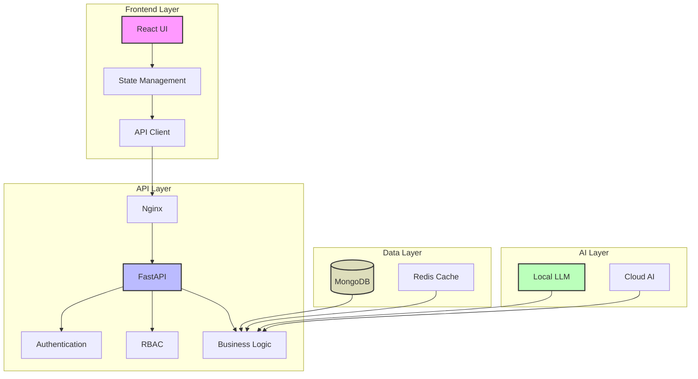
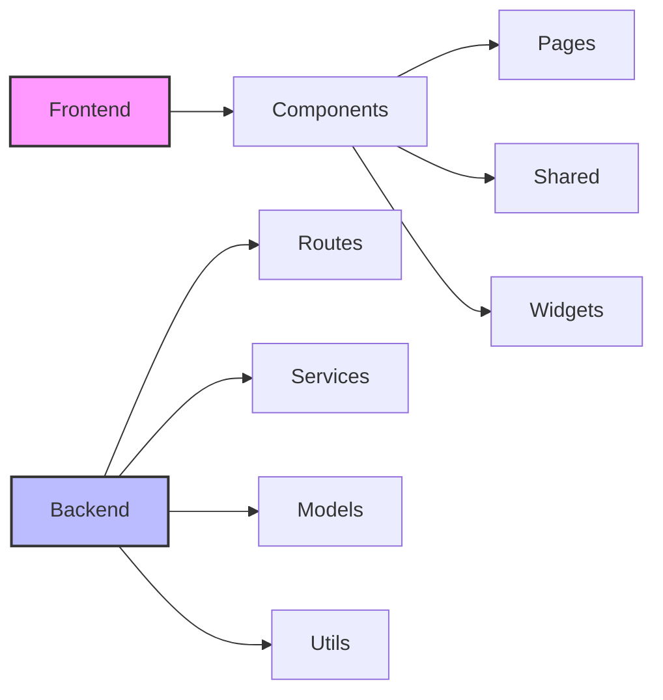
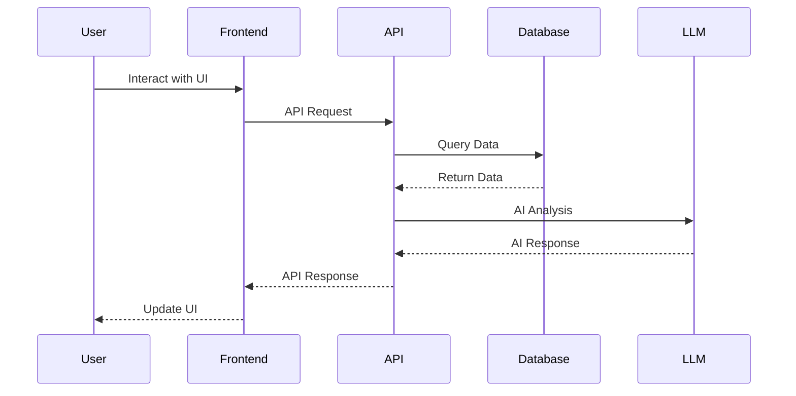
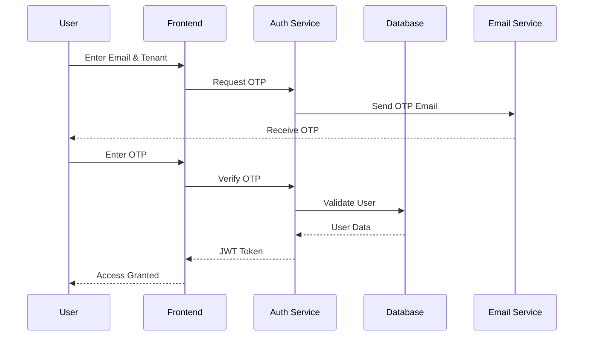
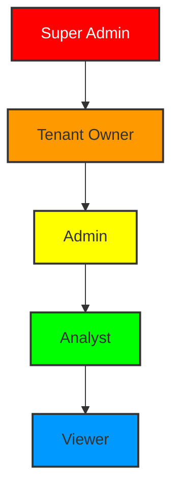

# Architecture Overview

## System Architecture

### High-Level Overview


### Deployment Architecture
```mermaid
graph TD
    subgraph "Client Layer"
        A[Browser] --> B[CDN]
        C[Mobile App] --> D[API Gateway]
    end
    
    subgraph "Application Layer"
        E[Load Balancer] --> F1[App Server 1]
        E --> F2[App Server 2]
        G[Redis Cluster]
    end
    
    subgraph "Database Layer"
        H[(Primary DB)] --> I[(Secondary DB)]
        J[(Backup DB)]
    end
    
    B --> E
    D --> E
    F1 --> G
    F2 --> G
    F1 --> H
    F2 --> H
    
    style E fill:#f9f,stroke:#333,stroke-width:2px
    style H fill:#bbf,stroke:#333,stroke-width:2px

```mermaid
graph TD
    A[Frontend - React/Vite] --> B[Nginx Reverse Proxy]
    B --> C[Backend - FastAPI]
    C --> D[(MongoDB)]
    C --> E[Local LLM Service]
    C --> F[External APIs]
    G[WebSocket Server] --> C
    H[Authentication Service] --> C
    I[RBAC Service] --> C
    
    style A fill:#f9f,stroke:#333,stroke-width:2px
    style C fill:#bbf,stroke:#333,stroke-width:2px
    style D fill:#ddb,stroke:#333,stroke-width:2px
```

## Component Architecture



## Data Flow



## Authentication Flow



## RBAC Structure



## Directory Structure

```plaintext
JupiterEmerge/
├── backend/
│   ├── ai_routes.py
│   ├── ai_services.py
│   ├── server.py
│   └── requirements.txt
├── frontend/
│   ├── src/
│   │   ├── components/
│   │   ├── pages/
│   │   ├── utils/
│   │   └── App.jsx
│   └── package.json
├── docs/
│   ├── API.md
│   ├── DEPLOYMENT.md
│   └── DEVELOPMENT.md
└── docker-compose.yml
```
