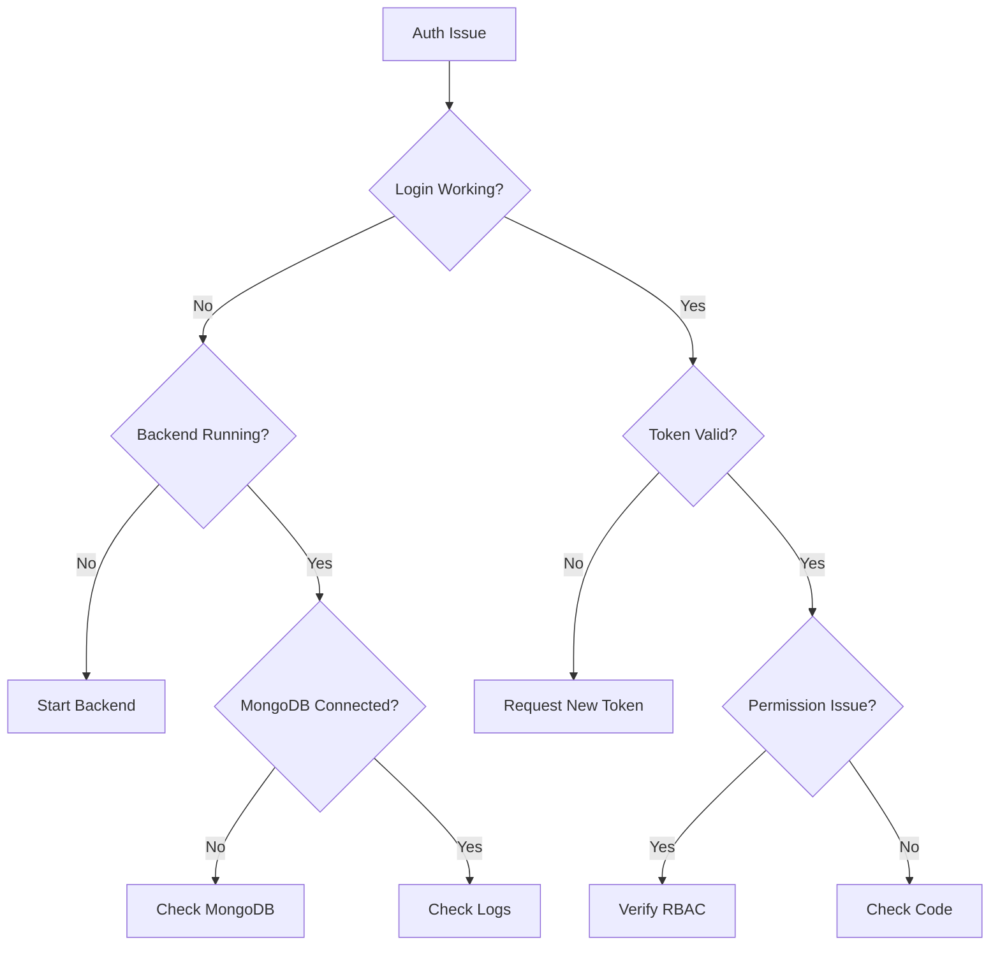
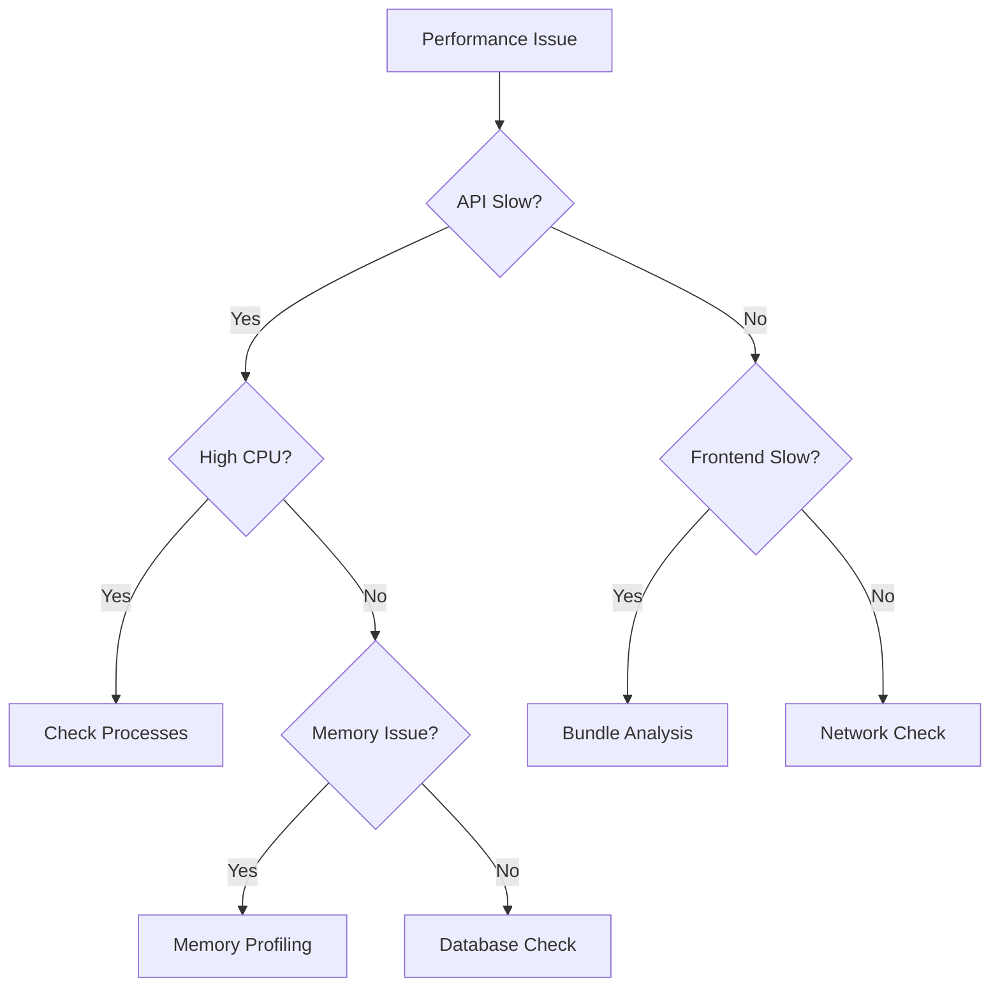
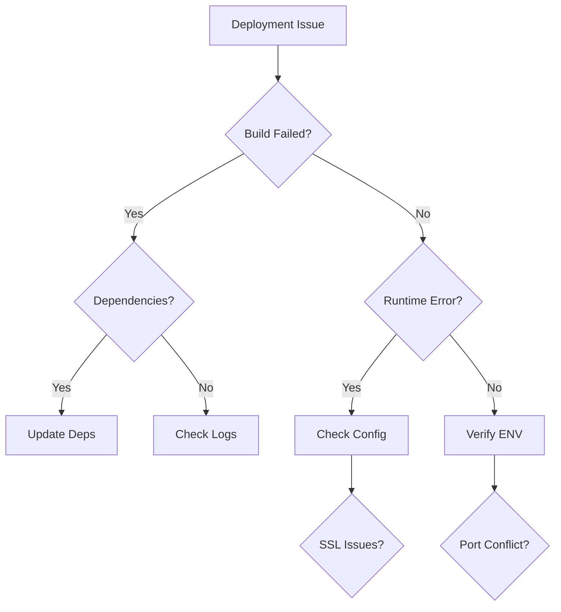
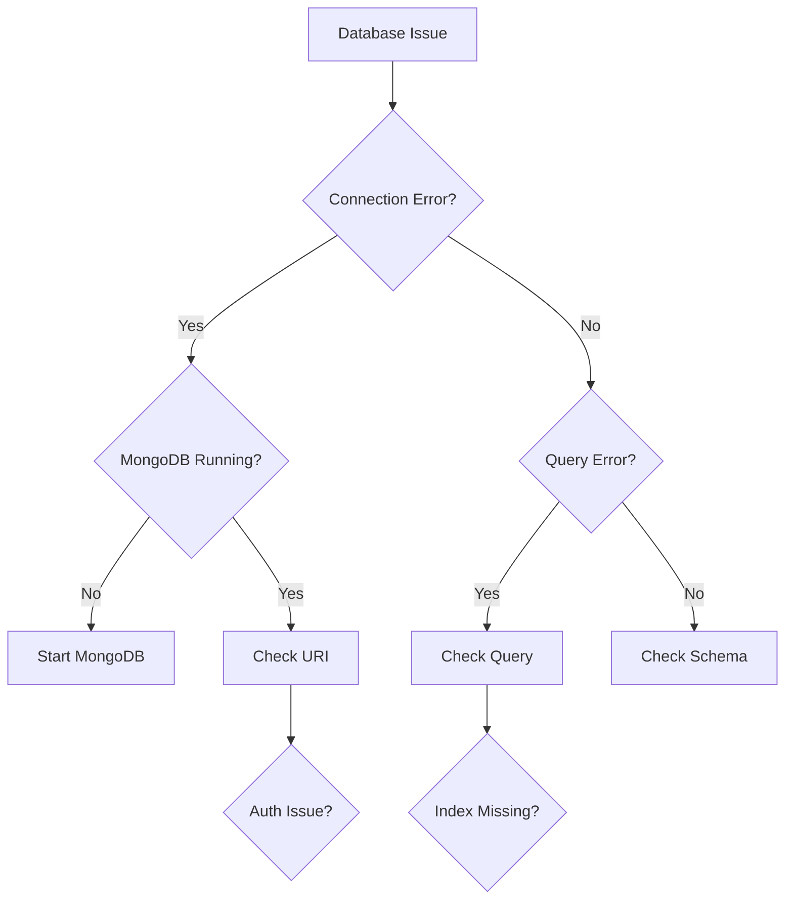

# Troubleshooting Flowcharts

## Authentication Issues

```mermaid
graph TD
    A[Auth Issue] --> B{Login Working?}
    B -->|No| C{Backend Running?}
    B -->|Yes| D{Token Valid?}
    
    C -->|No| E[Start Backend]
    C -->|Yes| F{MongoDB Connected?}
    
    D -->|No| G[Request New Token]
    D -->|Yes| H{Permission Issue?}
    
    F -->|No| I[Check MongoDB]
    F -->|Yes| J[Check Logs]
    
    H -->|Yes| K[Verify RBAC]
    H -->|No| L[Check Code]
```

## Performance Issues

```mermaid
graph TD
    A[Performance Issue] --> B{API Slow?}
    B -->|Yes| C{High CPU?}
    B -->|No| D{Frontend Slow?}
    
    C -->|Yes| E[Check Processes]
    C -->|No| F{Memory Issue?}
    
    D -->|Yes| G[Bundle Analysis]
    D -->|No| H[Network Check]
    
    F -->|Yes| I[Memory Profiling]
    F -->|No| J[Database Check]
```

## Deployment Issues

```mermaid
graph TD
    A[Deployment Issue] --> B{Build Failed?}
    B -->|Yes| C{Dependencies?}
    B -->|No| D{Runtime Error?}
    
    C -->|Yes| E[Update Deps]
    C -->|No| F[Check Logs]
    
    D -->|Yes| G[Check Config]
    D -->|No| H[Verify ENV]
    
    G --> I{SSL Issues?}
    H --> J{Port Conflict?}
```

## Database Issues

```mermaid
graph TD
    A[Database Issue] --> B{Connection Error?}
    B -->|Yes| C{MongoDB Running?}
    B -->|No| D{Query Error?}
    
    C -->|No| E[Start MongoDB]
    C -->|Yes| F[Check URI]
    
    D -->|Yes| G[Check Query]
    D -->|No| H[Check Schema]
    
    F --> I{Auth Issue?}
    G --> J{Index Missing?}
```
