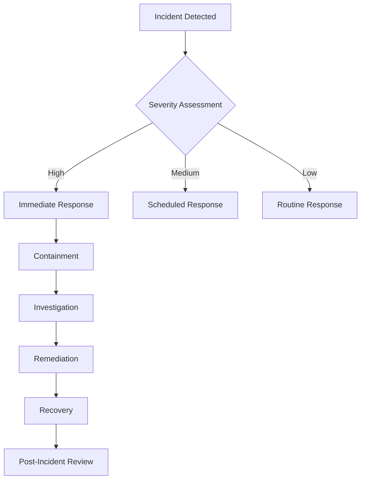

# Security Guidelines

## Overview
Project Jupiter implements industry-standard security practices to protect sensitive data and ensure system integrity. This document outlines our security measures, best practices, and guidelines for maintaining a secure system.

## Security Architecture

### Authentication & Authorization
1. **JWT-based Authentication**
   - Token expiration: 1 hour
   - Refresh tokens: 7 days
   - Secure token storage in HttpOnly cookies
   
2. **Role-Based Access Control (RBAC)**
   ```javascript
   const roles = {
     ADMIN: ['read:*', 'write:*', 'delete:*'],
     ANALYST: ['read:*', 'write:cases', 'write:alerts'],
     USER: ['read:cases', 'read:alerts', 'write:comments']
   }
   ```

3. **Multi-Factor Authentication (MFA)**
   - Time-based One-Time Password (TOTP)
   - Backup codes for recovery
   - Device verification

### Data Security

1. **Encryption**
   - Data at rest: AES-256
   - Data in transit: TLS 1.3
   - Key rotation policy: 90 days

2. **PII Handling**
   ```python
   def mask_pii(data):
       # Mask email addresses
       data['email'] = f'{data["email"][:3]}...@{data["email"].split("@")[1]}'
       # Mask IP addresses
       data['ip'] = f'{data["ip"].split(".")[0]}.xxx.xxx.xxx'
       return data
   ```

3. **Data Classification**
   - PUBLIC: Open access
   - INTERNAL: Authenticated users only
   - CONFIDENTIAL: Role-based access
   - RESTRICTED: Admin only

### Network Security

1. **Firewall Rules**
```nginx
# Example nginx configuration
location /api {
    # Rate limiting
    limit_req zone=api burst=20 nodelay;
    
    # IP whitelist
    allow 192.168.1.0/24;
    deny all;
    
    proxy_pass http://backend;
}
```

2. **DDoS Protection**
   - Rate limiting
   - Request filtering
   - Load balancing
   - Traffic analysis

3. **SSL/TLS Configuration**
```nginx
ssl_protocols TLSv1.2 TLSv1.3;
ssl_ciphers ECDHE-ECDSA-AES128-GCM-SHA256:ECDHE-RSA-AES128-GCM-SHA256;
ssl_prefer_server_ciphers off;
ssl_session_tickets off;
ssl_stapling on;
ssl_stapling_verify on;
```

## Security Controls

### Input Validation
1. **API Request Validation**
```python
from pydantic import BaseModel, EmailStr, constr

class UserInput(BaseModel):
    email: EmailStr
    password: constr(min_length=12)
    name: constr(max_length=100)
```

2. **SQL Injection Prevention**
```python
from sqlalchemy import text

def safe_query(user_id):
    # Use parameterized queries
    return db.execute(
        text('SELECT * FROM users WHERE id = :id'),
        {'id': user_id}
    )
```

3. **XSS Prevention**
```javascript
// React automatically escapes content
const SafeHtml = ({ content }) => {
  // Use DOMPurify for user-generated content
  const clean = DOMPurify.sanitize(content);
  return <div dangerouslySetInnerHTML={{ __html: clean }} />;
};
```

### Monitoring & Logging

1. **Security Event Logging**
```python
import logging
logger = logging.getLogger('security')

def log_security_event(event_type, user_id, details):
    logger.warning(f'Security Event: {event_type}', extra={
        'user_id': user_id,
        'details': details,
        'timestamp': datetime.utcnow()
    })
```

2. **Audit Trail**
```sql
CREATE TABLE audit_log (
    id SERIAL PRIMARY KEY,
    user_id UUID,
    action VARCHAR(50),
    resource_type VARCHAR(50),
    resource_id UUID,
    details JSONB,
    timestamp TIMESTAMP DEFAULT NOW()
);
```

3. **Alert Configuration**
```yaml
alerts:
  failed_login:
    threshold: 5
    window: 5m
    action: block_ip
  
  suspicious_activity:
    conditions:
      - multiple_resources_deleted
      - unusual_access_pattern
    action: notify_admin
```

## Incident Response

### 1. Detection
- Automated scanning
- Log analysis
- User reports
- Security monitoring

### 2. Response Plan


### 3. Recovery Procedures
1. Backup restoration
2. Service restoration
3. Communication plan
4. Post-incident analysis

## Security Maintenance

### 1. Regular Updates
```bash
# Update system packages
sudo apt update && sudo apt upgrade -y

# Update Node.js dependencies
npm audit fix

# Update Python dependencies
pip list --outdated
pip install -U $(pip list --outdated | cut -d ' ' -f 1)
```

### 2. Security Scanning
```bash
# Run security scans
npm audit
safety check
bandit -r .
trivy fs .
```

### 3. Certificate Management
```bash
# Generate CSR
openssl req -new -key private.key -out cert.csr

# Renew certificates
certbot renew
```

## Compliance

### 1. GDPR Compliance
- Data minimization
- Right to be forgotten
- Data portability
- Consent management

### 2. Security Standards
- OWASP Top 10
- CIS Benchmarks
- ISO 27001
- SOC 2

### 3. Regular Audits
- Quarterly internal audits
- Annual external audits
- Penetration testing
- Vulnerability assessments

### Data Security
- End-to-end encryption
- Data sanitization
- Input validation
- XSS protection
- CSRF protection

### API Security
- Rate limiting
- Request validation
- IP filtering
- Security headers
- SSL/TLS enforcement

## Security Best Practices

### 1. Authentication
```python
# Backend JWT configuration
JWT_ALGORITHM = "HS256"
JWT_ACCESS_TOKEN_EXPIRE_MINUTES = 30
JWT_REFRESH_TOKEN_EXPIRE_DAYS = 7

# Token rotation
def rotate_refresh_token(user_id: str) -> str:
    # Implement token rotation logic
    pass
```

### 2. Authorization
```python
# RBAC implementation
def check_permission(user_role: str, required_permission: str) -> bool:
    role_permissions = get_role_permissions(user_role)
    return required_permission in role_permissions
```

### 3. Data Protection
```python
# Data encryption
def encrypt_sensitive_data(data: str) -> str:
    # Implement encryption logic
    pass

# Data sanitization
def sanitize_input(data: str) -> str:
    # Implement sanitization logic
    pass
```

### 4. API Protection
```python
# Rate limiting
RATE_LIMIT = {
    "DEFAULT": "60/minute",
    "AUTH": "5/minute",
    "AI": "10/minute"
}

# Request validation
def validate_request(request: Request) -> bool:
    # Implement validation logic
    pass
```

## Security Configurations

### 1. Nginx Security Headers
```nginx
# Security headers
add_header X-Frame-Options "SAMEORIGIN";
add_header X-XSS-Protection "1; mode=block";
add_header X-Content-Type-Options "nosniff";
add_header Content-Security-Policy "default-src 'self'";
add_header Referrer-Policy "strict-origin-when-cross-origin";
```

### 2. MongoDB Security
```javascript
// MongoDB user roles
db.createUser({
  user: "jupiter_admin",
  pwd: "secure_password",
  roles: [
    { role: "dbOwner", db: "jupiter_siem" }
  ]
})
```

### 3. SSL Configuration
```bash
# Generate SSL certificate
certbot --nginx -d projectjupiter.in

# SSL configuration
ssl_protocols TLSv1.2 TLSv1.3;
ssl_prefer_server_ciphers on;
ssl_ciphers ECDHE-ECDSA-AES128-GCM-SHA256:ECDHE-RSA-AES128-GCM-SHA256;
```

## Security Monitoring

### 1. Logging
```python
# Security event logging
def log_security_event(event_type: str, details: dict):
    logger.security.info({
        "event": event_type,
        "timestamp": datetime.utcnow(),
        "details": details
    })
```

### 2. Alerts
```python
# Security alert system
def send_security_alert(severity: str, message: str):
    alert = {
        "severity": severity,
        "message": message,
        "timestamp": datetime.utcnow()
    }
    notify_security_team(alert)
```

### 3. Audit Trail
```python
# Audit logging
def audit_log(user_id: str, action: str, resource: str):
    audit = {
        "user_id": user_id,
        "action": action,
        "resource": resource,
        "timestamp": datetime.utcnow(),
        "ip_address": request.client.host
    }
    save_audit_log(audit)
```

## Security Checklist

### Development
- [ ] Input validation on all forms
- [ ] Parameterized queries
- [ ] Secure password handling
- [ ] API authentication
- [ ] CORS configuration

### Deployment
- [ ] SSL certificates
- [ ] Security headers
- [ ] Firewall rules
- [ ] Rate limiting
- [ ] Monitoring setup

### Maintenance
- [ ] Regular updates
- [ ] Security patches
- [ ] Log rotation
- [ ] Backup verification
- [ ] Security audits
