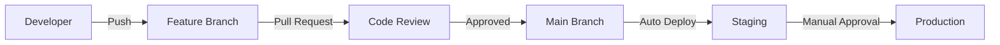

# CI/CD Pipeline Guide

## Overview
This document outlines our Continuous Integration and Continuous Deployment (CI/CD) pipeline configuration using GitHub Actions.

## Pipeline Structure

### 1. Development Workflow


## GitHub Actions Workflows

### 1. Pull Request Checks
```yaml
# .github/workflows/pr-checks.yml
name: Pull Request Checks

on:
  pull_request:
    branches: [ main ]

jobs:
  verify:
    runs-on: ubuntu-latest
    steps:
      - uses: actions/checkout@v3

      - name: Setup Node.js
        uses: actions/setup-node@v3
        with:
          node-version: '18'
          
      - name: Setup Python
        uses: actions/setup-python@v4
        with:
          python-version: '3.10'
          
      - name: Install Dependencies
        run: |
          npm ci
          cd backend && pip install -r requirements.txt
          
      - name: Run Tests
        run: |
          npm test
          cd backend && pytest
          
      - name: Security Scan
        run: |
          npm audit
          cd backend && safety check

      - name: Lint Check
        run: |
          npm run lint
          cd backend && flake8
```

### 2. Staging Deployment
```yaml
# .github/workflows/staging-deploy.yml
name: Deploy to Staging

on:
  push:
    branches: [ main ]

jobs:
  deploy-staging:
    runs-on: ubuntu-latest
    steps:
      - uses: actions/checkout@v3
      
      - name: Configure AWS
        uses: aws-actions/configure-aws-credentials@v1
        with:
          aws-access-key-id: ${{ secrets.AWS_ACCESS_KEY_ID }}
          aws-secret-access-key: ${{ secrets.AWS_SECRET_ACCESS_KEY }}
          aws-region: us-east-1
          
      - name: Build and Push Docker Images
        run: |
          docker build -t jupiter-frontend ./frontend
          docker build -t jupiter-backend ./backend
          docker tag jupiter-frontend:latest ${{ secrets.ECR_REGISTRY }}/jupiter-frontend:latest
          docker tag jupiter-backend:latest ${{ secrets.ECR_REGISTRY }}/jupiter-backend:latest
          docker push ${{ secrets.ECR_REGISTRY }}/jupiter-frontend:latest
          docker push ${{ secrets.ECR_REGISTRY }}/jupiter-backend:latest
          
      - name: Deploy to ECS
        run: |
          aws ecs update-service --cluster staging --service jupiter-frontend --force-new-deployment
          aws ecs update-service --cluster staging --service jupiter-backend --force-new-deployment
```

### 3. Production Deployment
```yaml
# .github/workflows/prod-deploy.yml
name: Deploy to Production

on:
  workflow_dispatch:
    inputs:
      version:
        description: 'Version to deploy'
        required: true

jobs:
  deploy-production:
    runs-on: ubuntu-latest
    environment: production
    steps:
      - uses: actions/checkout@v3
      
      - name: Configure AWS
        uses: aws-actions/configure-aws-credentials@v1
        with:
          aws-access-key-id: ${{ secrets.AWS_ACCESS_KEY_ID }}
          aws-secret-access-key: ${{ secrets.AWS_SECRET_ACCESS_KEY }}
          aws-region: us-east-1
          
      - name: Deploy to Production
        run: |
          aws ecs update-service --cluster production --service jupiter-frontend --force-new-deployment
          aws ecs update-service --cluster production --service jupiter-backend --force-new-deployment
```

## Infrastructure as Code

### 1. AWS ECS Cluster (Terraform)
```hcl
# infrastructure/terraform/ecs.tf
resource "aws_ecs_cluster" "jupiter" {
  name = "${var.environment}-jupiter-cluster"
  
  setting {
    name  = "containerInsights"
    value = "enabled"
  }
}

resource "aws_ecs_service" "frontend" {
  name            = "jupiter-frontend"
  cluster         = aws_ecs_cluster.jupiter.id
  task_definition = aws_ecs_task_definition.frontend.arn
  desired_count   = 2
  
  load_balancer {
    target_group_arn = aws_lb_target_group.frontend.arn
    container_name   = "frontend"
    container_port   = 80
  }
}

resource "aws_ecs_service" "backend" {
  name            = "jupiter-backend"
  cluster         = aws_ecs_cluster.jupiter.id
  task_definition = aws_ecs_task_definition.backend.arn
  desired_count   = 2
  
  load_balancer {
    target_group_arn = aws_lb_target_group.backend.arn
    container_name   = "backend"
    container_port   = 8000
  }
}
```

### 2. MongoDB Atlas (Terraform)
```hcl
# infrastructure/terraform/mongodb.tf
resource "mongodbatlas_cluster" "jupiter" {
  project_id = var.atlas_project_id
  name       = "${var.environment}-jupiter"
  
  provider_name               = "AWS"
  provider_region_name       = "US_EAST_1"
  provider_instance_size_name = "M10"
  
  backup_enabled = true
  pit_enabled    = true
  
  advanced_configuration {
    javascript_enabled = true
    minimum_enabled_tls_protocol = "TLS1_2"
  }
}
```

## Monitoring & Alerts

### 1. CloudWatch Alarms
```yaml
Resources:
  HighCPUAlarm:
    Type: AWS::CloudWatch::Alarm
    Properties:
      AlarmName: ${Environment}-high-cpu
      MetricName: CPUUtilization
      Namespace: AWS/ECS
      Statistic: Average
      Period: 300
      EvaluationPeriods: 2
      Threshold: 80
      AlarmActions:
        - !Ref AlertsTopic
      Dimensions:
        - Name: ClusterName
          Value: !Ref ECSCluster

  HighMemoryAlarm:
    Type: AWS::CloudWatch::Alarm
    Properties:
      AlarmName: ${Environment}-high-memory
      MetricName: MemoryUtilization
      Namespace: AWS/ECS
      Statistic: Average
      Period: 300
      EvaluationPeriods: 2
      Threshold: 80
      AlarmActions:
        - !Ref AlertsTopic
```

### 2. Error Rate Monitoring
```yaml
Resources:
  APIErrorRateAlarm:
    Type: AWS::CloudWatch::Alarm
    Properties:
      AlarmName: ${Environment}-api-error-rate
      MetricName: 5XXError
      Namespace: AWS/ApiGateway
      Statistic: Sum
      Period: 300
      EvaluationPeriods: 2
      Threshold: 10
      AlarmActions:
        - !Ref AlertsTopic
```

## Rollback Procedures

### 1. Automated Rollback
```yaml
jobs:
  deploy:
    steps:
      - name: Deploy
        id: deploy
        run: |
          # Store current version for rollback
          echo "PREVIOUS_VERSION=$(aws ecs describe-services --cluster production --services jupiter-backend --query 'services[0].taskDefinition')" >> $GITHUB_ENV
          
          # Deploy new version
          aws ecs update-service --cluster production --service jupiter-backend --task-definition $NEW_VERSION
          
      - name: Monitor Deployment
        run: |
          # Monitor health checks
          for i in {1..30}; do
            if aws ecs describe-services --cluster production --services jupiter-backend --query 'services[0].deployments[0].rolloutState' | grep -q "COMPLETED"; then
              exit 0
            fi
            sleep 10
          done
          exit 1
          
      - name: Rollback on Failure
        if: failure()
        run: |
          echo "Deployment failed, rolling back to ${{ env.PREVIOUS_VERSION }}"
          aws ecs update-service --cluster production --service jupiter-backend --task-definition ${{ env.PREVIOUS_VERSION }}
```

## Release Process

### 1. Version Tagging
```bash
#!/bin/bash
# scripts/release.sh

# Get current version
current_version=$(cat package.json | jq -r .version)

# Create release branch
git checkout -b release/$current_version

# Tag release
git tag -a v$current_version -m "Release v$current_version"
git push origin v$current_version

# Create GitHub release
gh release create v$current_version --title "Release v$current_version" --notes-file CHANGELOG.md
```

### 2. Changelog Management
```markdown
# CHANGELOG.md
## [1.2.0] - 2025-08-20
### Added
- Real-time alerts feature
- Advanced search capabilities

### Changed
- Improved dashboard performance
- Updated dependencies

### Fixed
- Authentication token refresh issue
- Memory leak in WebSocket connection
```

## Environment Configuration

### 1. Environment Variables
```yaml
# .github/workflows/deploy.yml
jobs:
  deploy:
    steps:
      - name: Create Environment Files
        run: |
          # Frontend
          cat << EOF > frontend/.env.production
          VITE_API_URL=${{ secrets.API_URL }}
          VITE_WS_URL=${{ secrets.WS_URL }}
          EOF
          
          # Backend
          cat << EOF > backend/.env.production
          MONGODB_URI=${{ secrets.MONGODB_URI }}
          JWT_SECRET=${{ secrets.JWT_SECRET }}
          EOF
```

### 2. Secrets Management
```yaml
# .github/workflows/deploy.yml
jobs:
  deploy:
    steps:
      - name: Configure AWS Parameter Store
        run: |
          aws ssm put-parameter \
            --name "/jupiter/${ENVIRONMENT}/database-url" \
            --value "${{ secrets.MONGODB_URI }}" \
            --type "SecureString" \
            --overwrite
```

## Backup & Recovery

### 1. Database Backups
```yaml
# .github/workflows/backup.yml
name: Database Backup

on:
  schedule:
    - cron: '0 0 * * *'  # Daily at midnight

jobs:
  backup:
    runs-on: ubuntu-latest
    steps:
      - name: Backup MongoDB
        run: |
          mongodump --uri "${{ secrets.MONGODB_URI }}" --archive=backup.gz --gzip
          
      - name: Upload to S3
        run: |
          aws s3 cp backup.gz s3://jupiter-backups/$(date +%Y-%m-%d)/
```

### 2. Recovery Procedures
```bash
#!/bin/bash
# scripts/restore.sh

# Usage: ./restore.sh <backup-date>
backup_date=$1

# Download backup from S3
aws s3 cp s3://jupiter-backups/$backup_date/backup.gz .

# Restore database
mongorestore --uri "$MONGODB_URI" --archive=backup.gz --gzip

# Verify restoration
mongo "$MONGODB_URI" --eval "db.runCommand({dbStats: 1})"
```
